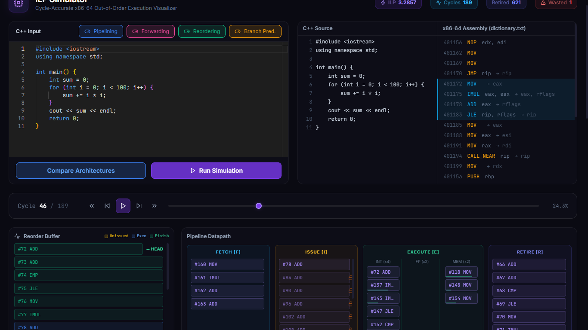
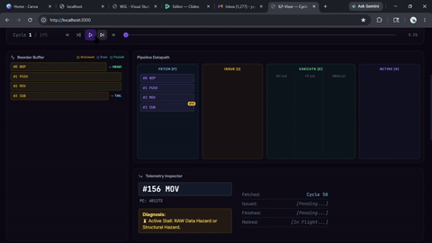

# ILP-Visor: Cycle-Accurate ILP Simulator & Visualizer

<!-- 📸 MAIN HERO IMAGE PLACEHOLDER -->
<!-- Replace the link below with a high-quality screenshot of your entire dashboard! -->


**ILP-Visor** is a comprehensive, standalone Instruction Level Parallelism (ILP) simulation framework. It combines dynamic binary instrumentation, an out-of-order CPU simulator, and a modern web-based analytics dashboard to visualize hardware execution, pipeline hazards, and performance bottlenecks.

## ✨ Why ILP-Visor?

**No manual compilation required!** ILP-Visor is designed to be completely plug-and-play. You do not need to manually compile your C++ code or interface with command-line simulation tools. Simply open the web dashboard, **paste your C/C++ code into the browser**, and the backend handles everything automatically:

1. Compiles your code on the server.
2. Uses the Intel Pin Tool to dynamically extract instruction traces.
3. Runs the C++ Cycle-Accurate Simulator.
4. Returns interactive, cycle-by-cycle visualizations.

---

## 🎥 Application Demo


<!-- 📸 GIF / IMAGE PLACEHOLDER 2: Pipeline Visualizer -->
<!-- Zoom in on the pipeline visualization showing stalls and flushes -->


<!-- 📸 IMAGE PLACEHOLDER 3: Architecture Compare Modal -->
<!-- Show the bar chart comparing different architectural configurations -->


---

## 🚀 Key Features

* **Fully Automated Pipeline**: From code pasting to visualization in one click.
* **Dynamic Trace Extraction**: Utilizes the **Intel Pin Tool** to dynamically instrument C/C++ binaries.
* **Highly Configurable C++ Simulator**: Toggle key architectural features from the UI:
  * Superscalar Pipelining
  * Data Forwarding / Bypassing
  * Out-of-Order Execution (Reorder Buffer)
  * Branch Prediction (using a Branch Target Buffer - BTB)
* **Web-Based Dashboard**: A sleek **Next.js** frontend providing professional-grade visualizations of the instruction window, ILP metrics, and pipeline bottlenecks.

## 🛠️ Prerequisites

* **Linux/WSL Environment** (Intel Pin requires a Linux environment)
* **C++ Compiler** (`g++` and `make`)
* **Python 3.8+**
* **Node.js 18+** & **npm**

## ⚙️ Installation & Setup (One-Click)

We provide an automated setup script that downloads Intel Pin, compiles the instrumentation tools, and installs all Node/Python dependencies for you.

1. Make the setup script executable:

   ```bash
   chmod +x setup.sh
   ```

2. Run the setup script:

   ```bash
   ./setup.sh
   ```

   *This script downloads the Intel Pin Tool into the project directory, so it runs completely independent of your local system setup!*

## 🏃 Running the Application

After running the setup script, you can start the entire application with a single command:

```bash
chmod +x run.sh
./run.sh
```

This will boot up both the Python backend and the Next.js frontend simultaneously.

### Analyze Code

Open your browser and navigate to **`http://localhost:3000`**.
Paste your C/C++ code into the editor, select your CPU architecture configurations, and click simulate!
